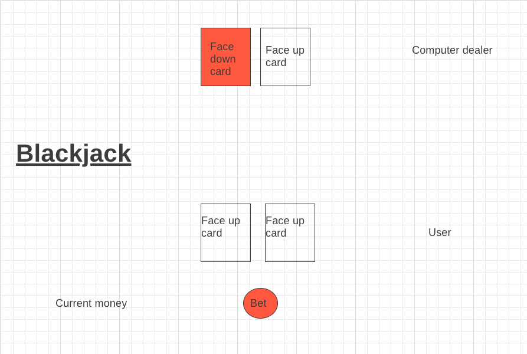

# Blackjack-game

[Website](https://georgekaval.github.io/Blackjack-game/)
1.As a user, I should be able to start a new blackjack game.  

2.As a user, I should be given an $200 allowance to play with.  

3.As a user, I should be told when I need to place an ante.  

4.As a user, I should be dealt 2 cards.  

5.As a user, I should be able to see my cards.  

6.As a user, I should be able to see 1 of the dealers 2 cards.  

7.As a user, I should be able to take an extra card.  

8.As a user, I should be able to stay.  

9.As a user, I should be able to be told if I won or lost the round.  

10.As a user, I should be payed my ante if I win, or lose my ante if I lose.  

11.As a user, I should be able to see how much money I currently have.  

12.As a user, I should be able to start a new round.  

13.As a user, I should be told that I lost if my money goes to 0.  

14.As a user, I should be told that I won if my money goes to $400  
